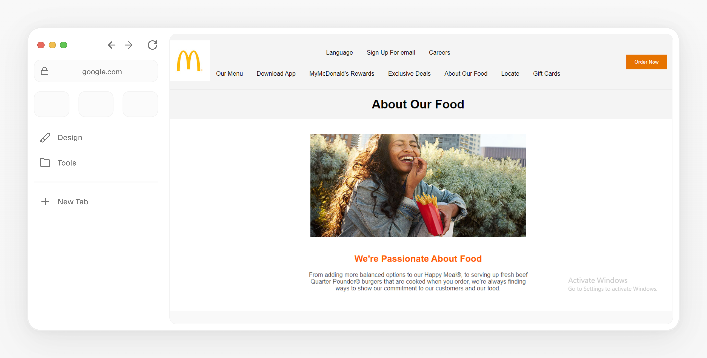
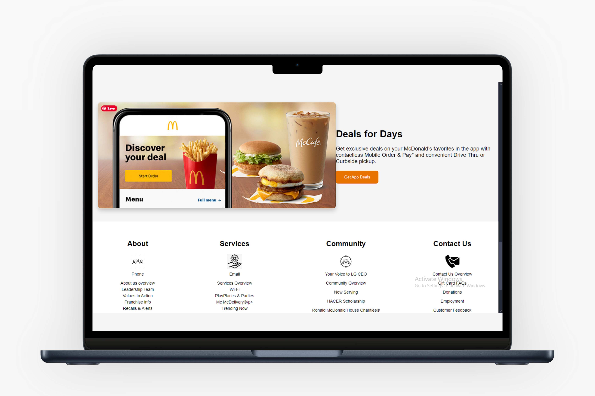
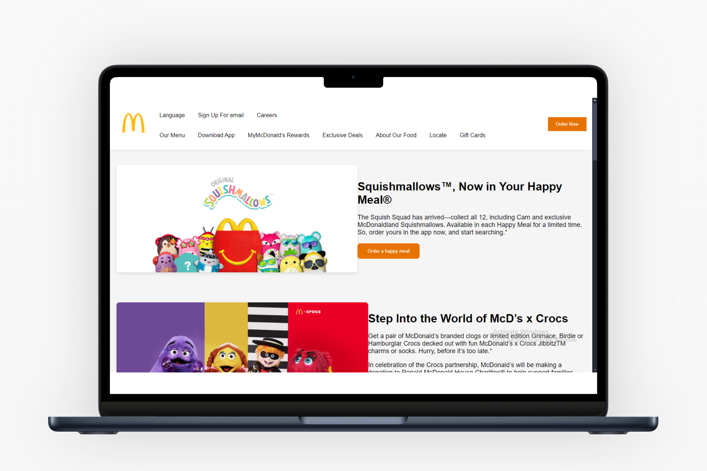

# McDonald's Website Clone

Welcome to the McDonald's website clone project! This project aims to replicate the McDonald's official website with HTML and CSS.

## Table of Contents

- [Description](#description)
- [Features](#features)
- [Screenshots](#screenshots)
- [Installation](#installation)

## Description

This project is a simple HTML and CSS clone of the McDonald's website homepage. It includes a navigation bar, main sections with images and content, and a contact section.

## Features
- Responsive design
- Navigation bar with dropdown menu
- Main sections with engaging images and content
- Contact section with links and icons

## Screenshots




## Installation
To run this project locally, follow these steps:
1. Clone the repository:

   ```bash
<https://github.com/Lawani-EJ/MCDonald-Web-Application.git>
